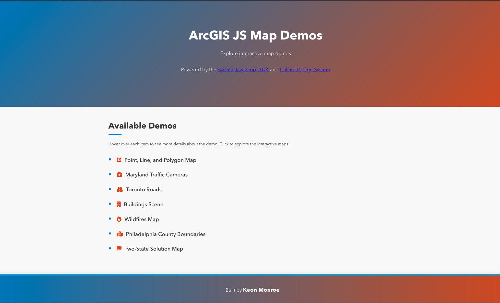

# ArcGIS JS Map Demos

A showcase of interactive map demos built with the ArcGIS JavaScript API and Calcite Design System. Explore a variety of real-world mapping examples, including 2D and 3D visualizations, live data, and custom symbology.

